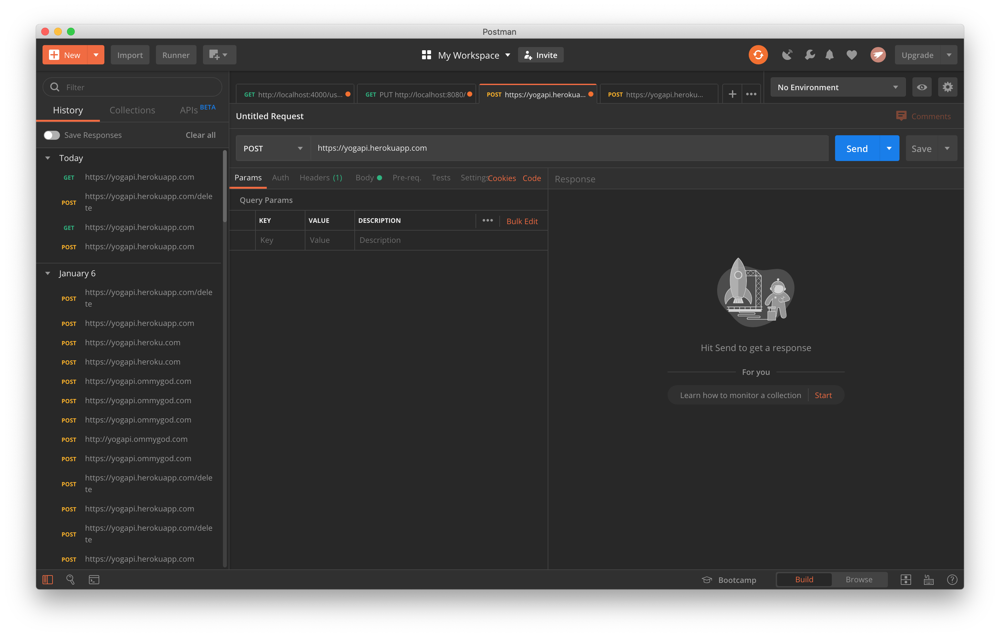

# Yoga API
API of
Sanskrit Name
English Name
Icon Image file from:https://github.com/rebeccaestes/yoga_api


## Postman guidance:
Heroku API Endpoint:
https://yogapi.herokuapp.com/

### Postman Walkthrough

[](https://youtu.be/Dyk5ZPxNk_A "Yogapi on Heroku")

### Get READ:
https://yogapi.herokuapp.com/
Returns all asanas as text.

### Post CREATE:
https://yogapi.herokuapp.com/
Body RAW JSON
```javascript
{
    "id": 49,
    "sanskrit_name": "Chakrasana",
    "english_name": "Wheel",
    "img_url": "https://storage.needpix.com/rsynced_images/yoga-3427131_1280.png"
}
```

### POST DELETE
https://yogapi.herokuapp.com/delete
```javascript
{
    "english_name": "Wheel"
}
```


